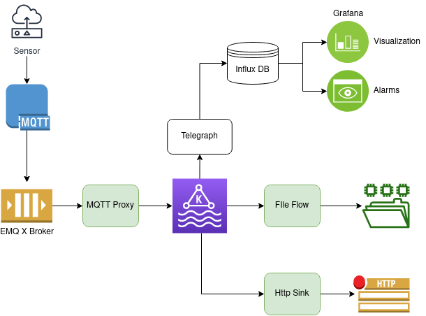

# Big IoT




## MQTT Proxy
Proxy messages between a MQTT Broker and a Kafka Broker.

### Infrastructure
```bash
docker-compose up -d

...
Creating zk ... done
Creating kafka ... done
Creating emqx          ... done
Creating kafka-manager ... done
```
http://localhost:9000/addCluster

### Environment variables configuration
LOG_LEVEL=DEBUG   
MQTT_HOST=localhost   
MQTT_PORT=1883   
MQTT_USER=...   
MQTT_PASS=...   
KAFKA_HOST=localhost   
KAFKA_PORT=9092   
TOPICS_IN=sensor_in_1,sensor_in_2,sensor_in_3   
TOPICS_OUT=sensor_out_1,sensor_out_2,sensor_out_3   